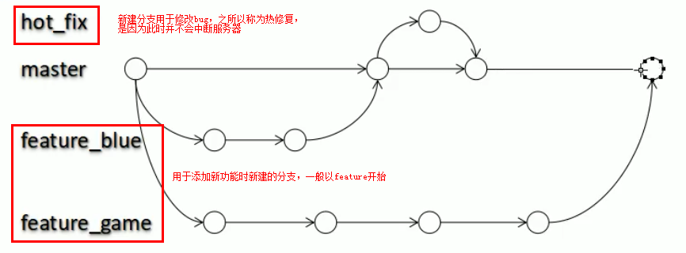
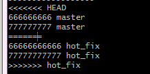

# 1.  初始配置：

## 1.1 安装git：
（1）windows：直接下载exe安装，安装完成之后设置用户名和邮箱
（2）Ubuntu：sudo apt-get install git

## 1.2 设置签名：

签名就是本地仓库的作者信息，在远程提交时，用于标注提交修改的作者。

（1）针对全局的签名设置

git config --global user.name "ZhangYu"

git config -- global user.email "939476975@qq.com"

（2）在项目文件夹下配置项目签名设置

git config user.name "ZhangYu"

git config user.email "939476975@qq.com"

## 1.3 让Git显示颜色：

git config --global color.ui true

# 2. git操作

## 2.1 创建版本仓库：

（1）新建一个文件夹
（2）在命令行中进入该文件夹
（3）运行git init，仓库建好了。文件夹下边会有.git目录

注：在仓库文件夹中新建、改动文本文件，git都会监视

## 2.2 查看当前文件添加、提交的状态：

git status

注1：Git跟踪的是文件的修改而不是文件。

注2：Git包含工作区、暂存区和本地库三部分。

注3：该命令可以用于查看当前的状态，包括是否有文件未从工作区提交至暂存区、从暂存区提交到本地库以及从本地库上传至服务器。

## 2.3 将工作区文件提交到暂存区： 

git add 文件名

## 2.4 将暂存区文件提交到本地库 

git commit -m "说明文字" [文件名]

注：上述命令，如果带有文件名，则只提交指定文件；若没有带文件名，则将所有暂存区的文件均同步到本地库。

# 3. 比较查看文件的修改：

（1）git diff 文件名：将工作区中的文件和暂存区进行比较

（2）git diff 本地库中某个版本号 文件名：将工作区中的文件和本地库中的某个版本进行比较

（3）git diff 命令若是不加文件名，可以同时比较所有文件（上述两种操作都是），但不推荐使用。

# 4. 查看命令提交日志：

（1）git log：查看最完整的历史提交日志信息。若是显示结果单屏溢出，可以通过空格向下翻页，通过b向上翻页，通过q退出。

（2）git log --pretty=oneline：查看单行显示且具有完整hash序列码的信息。

（3）git log --oneline：查看单行显示且具有部分hash序列码的信息。

（4）git reflog：查看单行显示、具有部分hash序列码且包含回退至每一版本需要的步数信息。其中，步数信息为HEAD@{n}中的n的值

# 5. 版本回退：

## 5.1 直接通过hash序列码来设置要改向的版本

（1）找到要改向的版本位置：git reflog命令查看历史记录，从中找到部分hash序列码，记为ID。
（2）设置为该位置：git reset --hard ID，其中ID为上一步找到的数字

## 5.2 其他快捷操作

（1）回退至上一版本：git reset --hard HEAD^
（2）回退至上N版本：git reset --hard HEAD~N 其中N为数字
（3）回退至上上个版本：git reset --hard HEAD^^
（4）撤销回退：通过9.1中的借助hash序列码的方法进行跳转

注：git reset --hard 命令本质上应该是将工作区、暂存区和本地库的指针统一到一个版本上。

# 6. 删除文件

（1）先从本地删除文件；
（2）利用git rm filename 从版本库中删除；或者也可以用git add 文件名 将操作提交到暂存区；
（3）利用git commit提交删除操作

# 7. 找回删除的文件

以下两种方式都必须保证被删除的文件之前已经添加到本地库或者暂存区，否则是无法找回的。

## 7.1 checkout命令==（建议使用）==

利用git checkout -- filename将文件从暂存区或版本库恢复至工作区。

利用此方法恢复文件不会产生新的记录，且被删除文件只提交至暂存区还是已经提交至本地库都可以使用此方法。

## 7.2 reset命令

利用reset命令，将工作区文件版本与本地库或者暂存区上述两种方式在本质上一样，都是

（1）被删除文件只从工作区提交到了暂存区

可以通过以下命令找回：git reset --hard HEAD

该命令本质上就是将暂存区和工作区均与本地库的HEAD指针同步

（2）被删除的文件已经提交到了本地库

可以通过一下命令找回：git reset --hard ID

ID指的是某个部分hash序列码。该命令本质上就是将工作区、暂存区和本地库的HEAD指针同步地切换到文件未被删除之前的某个ID，

# 8. 关于分支

## 8.1 分支的好处

（1）同时并行推进多个功能开发，提高开发效率

（2）各个分支在开发过程中，如果某一个分支开发失败，不会对其他分支造成任何影响，直接删除失败的分支，重新开始即可。  

## 8.2 分支相关操作

（1）创建分枝：git branch branch-name

（2）查看分枝：git branch -v，其中"-v"去掉也可以，只是会少显示部分信息。

（3）切换分枝：git checkout branch-name，切换分支后，之后的操作都是在该分支上。

（4）创建并切换分枝：git checkout -b branch-name  

（5）合并分枝：git merge branch-name 注：将branch-name分枝合并到当前分枝，即需要切换到接收合并的分支上。

（6）查看分枝合并图：git log --graph
		  信息单行显示：git log --graph --pretty=oneline --abbrev-commit
		  注：分枝合并时，不适用fast forward模式，会保留被合并的分枝信息，但是删除分枝后依然会丢失改信息。该命令  为： git merge --no-ff -m "merge with no-ff" branch-name 注：-m用于添加注释。

（7）删除分枝：git branch -d branch-name

（8）删除远程分枝：git push origin :branch-name 注：该命令中冒号和分枝名称必须连着。

## 8.3 解决冲突：

由于两个分支上都有工作在推进，所以合并时，可能会产生冲突，此时需要解决冲突后再完成合并。

（1）冲突表现：

（2）解决冲突：

- 编辑文件，删除因冲突产生的特殊符号
- 把文件修改到满意的程度，保存退出
- 提交操作到暂存区：git add 文件名
- 完成冲突合并：git commit -m "日志信息"；注意，此处不能带文件名。

## 8.4 实际开发中的分支管理策略：
（1）master分支应该是非常稳定的，也就是仅用来发布新版本，平时不能在上面干活；
（2）dev分支用于实际开发，是不稳定的，到1.0版本发布时，再把dev分支合并到master上，在master分支发布1.0版本；
（3）开发人员都在dev分支上干活，每个人都有自己的分支，时不时地往dev分支上合并就可以了。

## 8.5 未保存分支切换

如果在当前分枝的更改没有提交就切换分枝，会报错，如果暂时还不能提交，可以先保存现场。

（1）保存现场：git stash
（2）查看之前保存的现场列表：git stash list
（3）恢复现场：git stash apply
（4）删除现场信息：git stash drop
（5）恢复现场同时删除信息：git stash pop

## 8.6 强行删除未被合并过的分支：

git branch -D branch-name

 注：开发一个新功能，最好新建一个分支。

# 9. 关于远程仓库

## 9.1 本地已有仓库与远程新建的仓库关联

（1）给远程仓库起别名，亦可理解为关联：
  git remote add origin git@github.com:michaelliao/learngit.git
  例如，我的账户为zy01270324，仓库名为GitFile，所以：
  git remote add origin git@github.com:zy01270324/GitFile.git
（2）第一次推送时，由于远程仓库是空的，所以加上了 -u，
  git push -u origin master
  第一次使用会有警告，通过就行。
（3）之后推送就直接输入：
  git push origin master

注：此命令的意思为推送到origin对应的远程仓库的master分支上

## 9.2 远程建立仓库后，克隆至本地

git clone git@github.com:zy01270324/GitFile.git

## 9.3 查看远程仓库的信息：

（1）简略信息：git remote
（2）详细信息：git remote -v
## 9.4 远程仓库的分枝使用：
（1）master分支是主分支，因此要时刻与远程同步；
（2）dev分支是开发分支，团队所有成员都需要在上面工作，所以也需要与远程同步；
（3）bug分支只用于在本地修复bug，就没必要推到远程了，除非老板要看看你每周到底修复了几个bug；
（4）feature分支是添加新功能的分枝，是否推到远程，取决于你是否和你的小伙伴合作在上面开发。

## 9.5 多人协作远程合并时产生冲突的应对方法：
（1）可以试图用git push origin branch-name推送自己的修改；
（2）如果推送失败，则因为远程分支比你的本地更新，需要先用git pull先进行拉取，并尝试合并；
（3）如果合并有冲突，则解决冲突，并在本地add和commit；
（4）最后用git push origin branch-name推送就能成功！
  注:如果git pull提示no tracking information，则说明本地分支和远程分支的链接关系没有创建，
  用命令git branch --set-upstream-to branch-name origin/branch-name
## 9.6 本地未push的分叉整理 

rebase操作可以把本地未push的分叉提交历史整理成直线；

rebase的目的是使得我们在查看历史提交的变化时更容易，因为分叉的提交需要三方对比。

## 10. 标签的使用

## 10.1 使用本地标签：
（1）命令git tag <tagname>用于新建一个标签，默认为HEAD，也可以指定一个commit id：git tag <tagname> commitid；
（2）命令git tag -a <tagname> -m "blablabla..."可以指定标签信息；
（3）命令git tag可以查看所有标签。
（4）命令git show <tagname>可以看到说明文字。

## 10.2 使用远程标签：
（1）命令git push origin <tagname>可以推送一个本地标签；
（2）命令git push origin --tags可以推送全部未推送过的本地标签；
（3）命令git tag -d <tagname>可以删除一个本地标签；
（4）命令git push origin :refs/tags/<tagname>可以删除一个远程标签。